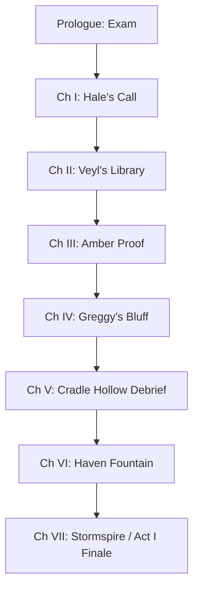

# 🎬 AZ TAMER — CINEMATICS & STORYTELLING BIBLE
### *The Director's Guide to Aurel: Camera, Lighting, Atmosphere, and Character Dialect*

This document outlines the cinematic framework and choreographic design for all **MAIN quests** in the *AZ Tamer* saga. Use this as a reference guide to build, write, and stage story sequences so they feel alive, premium, and visually engaging.

---

## 🎥 PART I: THE CINEMATOLOGY ENGINE & CORE PHILOSOPHY

AZ Tamer does not play story dialogues over black screens or static boxes. Every conversation happens inside a **living 3D backdrop (CineKind)**. 

### 1. The Directorial Rules
* **No Standing Statues**: Actors must idle, gesture, look at each other, shift their weight, or adjust their gear.
* **Handheld Camera Sway**: Every shot has a subtle, continuous mathematical sway (`Math.sin` lerped onto camera vectors) to feel like a real camera operator is holding the lens.
* **Glide Transitions**: Panning or changing camera shots MUST use smooth linear interpolation (`lerp`) so the viewer's eye flows naturally from a wide shot to an actor's close-up.
* **Mutual Facing**: When a character starts speaking, their voxel actor rotates to face the current focus (usually the player or another speaker), adding natural blocking to the scene.

### 2. Lighting & Atmosphere Systems
Each cinematic backdrop uses specific lighting rigs to establish mood:
* **The Warm Camp (`camp`)**: High-contrast, firelit shadows. A point light with randomized flickers simulates logs burning. Sky gradient is deep navy to starry black.
* **The High-Tech Console (`academy` / `hyujon`)**: Cool fluorescent key lights, neon emissive screens, and wireframe holographic projections.
* **The Bioluminescent Grotto (`grotto`)**: Violet ambient lighting, pulsing emissive flowers, and wet, metallic reflections on keel-stone.
* **The Media Cathedral (`mirrorhouse` / `cathedral`)**: Piercing shafts of white/blue light (volumetric simulation), high-contrast shadows, and spark-motes resembling camera flashes.

---

## 👥 PART II: CAST PROFILE & DIALOGUE DIALECT

Every major character in the *Anomalies* saga has a specific verbal style and physical presence. Keep these rules consistent in all scripts:

### 1. Aljay the Dawnflame (The Introverted Legend)
* **Personality**: Extremely wise, deeply introverted, carries the quiet weight of the world. He doesn't speak to hear himself talk; he speaks because something must be set straight.
* **Dialogue Dialect**: Sparse, reflective, and poetic. He speaks in short sentences with heavy pauses. He never uses exclamation points. He refers to Guardians as equals, never tools.
* **Body Language**: Standing still, head tilted slightly downward. He looks at his hands or the horizon. When he looks directly at someone, they feel the full focus of his wisdom.
* **Script Example**: 
  > *"The seal doesn't keep the dark out. It keeps our choices in. ... We build the lanterns, but we always forget to carry the light."*

### 2. Greggy the Stormheart (The Weathered Mentor)
* **Personality**: Weathered, gruff, easily annoyed but deeply caring. A retired legend who masks his anxiety with tests and dry humor.
* **Dialogue Dialect**: Colloquial, direct, slightly abrasive but wise. Uses contractions often. Often interrupts his own thoughts with a sigh or a snort.
* **Body Language**: Arms crossed, standing on the edge of the bluff, looking up at the sky. Shakes his head at the player's naive questions.
* **Script Example**: 
  > *"You think that diploma makes you a tamer? Hmph. Trial Burrows are a sandbox, kid. Ghandra doesn't care about your grades. Now pack your tonics and show me you can walk without tripping."*

### 3. Azrin the Emberlark (The Burning Champion)
* **Personality**: A 16-year-old prodigy. Charismatic, fierce, and fast. Underneath her confident champion persona, she is terrified for her missing sister.
* **Dialogue Dialect**: Rapid, determined, high-energy. She speaks like a storm coming in. She hides her vulnerability by talking about tournament brackets or combat math.
* **Body Language**: Fists clenched, pacing back and forth. Quick, sharp gestures. She stands tall even when her voice wavers.
* **Script Example**: 
  > *"I cleared the Coliseum before I was old enough to pilot a Crawler. I know the math, okay? I know what happens to people who get caught by the stillwater. We are not waiting. We go now."*

### 4. Azrael the Nightwing (The Quiet Mathematician)
* **Personality**: Younger sister, quiet genius, mathematical. She looks at the world through vectors, codes, and ciphers. Stubborn to a fault.
* **Dialogue Dialect**: Highly precise, technical, objective. She speaks in lower case, metaphorically—very few emotional outbursts.
* **Body Language**: Hunched over archives, adjusting her visor, scribbling notes. Rarely makes direct eye contact, but her voice is crystal clear.
* **Script Example**: 
  > *"the signal isn't a random decay pattern. it is an eleven-digit cipher repeating at forty-second intervals. my father knew the sequence. he left the key in the third volume of the ledger."*

### 5. Louie (The Gear-Man)
* **Personality**: Practical, warm, the reliable anchor of the old generation. He is the mechanic who kept the legends alive.
* **Dialogue Dialect**: Warm, conversational, uses engineering metaphors. Talks like a grandfather who has seen it all.
* **Body Language**: Pouring tea, wiping grease off his hands, looking over the rim of his spectacles. Always busy with a wrench or a circuit board.
* **Script Example**: 
  > *"Aljay's Crawler was like Aljay himself—stubborn manifold, running three times hotter than it should, held together by nothing but willpower and good grease. Drink your tea, let's look at the spark plugs."*

### 6. Ivan Lawrence (The Deleted Champion)
* **Personality**: A broken legend who found peace in exile. Humble, family-oriented, but still possesses the sharp mind of a 4-time champion.
* **Dialogue Dialect**: Calm, quiet, speaks with a gentle smile. Never bitter about his deletion, only protective of his new home.
* **Body Language**: Sitting on his porch, looking down at his scarred hands. Moves slowly, but stands perfectly straight when the topic turns to the old days.
* **Script Example**: 
  > *"They erased the records, but they couldn't erase the soil. The river still runs, the rice still grows. Let the broadsheets print their tomorrow. We have today."*

---

## 🎬 PART III: SCENE-BY-SCENE CINEMATIC PLAYBOOK

Below is the directory of all main story cinematics, mapped chapter by chapter.

### ACT I: THE ROAD TO THE STORMHEART

#### Cinematic 1: Prologue — The Graduation Trial
* **Quest Trigger**: `story_trial_briefing` & `story_graduation`
* **Scene Backdrop**: `academy` (Briefing Hall)
* **Atmosphere**: Bright morning light through high windows, humming holographic console, cadets studying.
* **Key Shots**:
  * `wide`: Displays the massive crest banner and the hall.
  * `terminal`: Close-up of the hero interacting with the green holo-orb.
  * `hale`: Low-angle, authoritative shot focusing on Instructor Hale's jacket and stern face.
* **Directorial Action**: Hale points to the terminal; the hero steps forward; the holo-orb pulses green light across the hero's face.

#### Cinematic 2: Chapter I — Hale's Radio Directive
* **Quest Trigger**: After clearing Trial Caverns.
* **Scene Backdrop**: `camp` (Trial Entrance)
* **Atmosphere**: Dusk, heavy purple fog rolling in, the Crawler's headlights cutting through the dark.
* **Key Shots**:
  * `crawler`: A low-angle shot of the massive Crawler engine.
  * `radio`: Close-up of the communicator crackling with static.
* **Directorial Action**: The communicator screen flashes amber; Hale's voice comes through with heavy static, warning of a signature mismatch in the deeper vaults.

#### Cinematic 3: Chapter II — Historian Veyl's Archives
* **Quest Trigger**: `story_meet_veyl`
* **Scene Backdrop**: `library` (Aurelian Archives)
* **Atmosphere**: Cold blue light from massive display screens, dust motes floating in the window beams, stacks of glowing data-crystals.
* **Key Shots**:
  * `desk`: Veyl hunched over a pile of ciphers, glasses reflecting blue screen-glow.
  * `crystals`: Rack of glowing amber memory shards.
* **Directorial Action**: Veyl doesn't look up when you enter; he slides a glowing crystal across the table; the camera tracks the crystal's light.

#### Cinematic 4: Chapter III — The Amber Proof
* **Quest Trigger**: Bringing the Storm-Touched Amber to Veyl.
* **Scene Backdrop**: `library` (Veyl's Private Desk)
* **Atmosphere**: Dimly lit, the amber shard casting a warm orange glow against the cold blue library.
* **Key Shots**:
  * `react`: Veyl's eyes widening as he holds the amber to the screen-light.
  * `wide`: The hero and Veyl standing over a projected sea-chart of Agdao.
* **Directorial Action**: The amber is placed on the console; a holographic representation of Agdao Island rises from the desk, rotating in gold light.

#### Cinematic 5: Chapter IV — The Retired Thunderhead
* **Quest Trigger**: Meeting Greggy on Agdao Island.
* **Scene Backdrop**: `bluff` (Agdao NE Cliff)
* **Atmosphere**: Raging ocean below, heavy storm clouds overhead, lightning flashing in the distance.
* **Key Shots**:
  * `cliff`: Wide shot of Greggy standing at the edge, storm winds whipping his coat.
  * `greggy`: Close-up of Greggy's weathered, scarred face.
  * `hero`: Hero climbing the final ledge, exhausted.
* **Directorial Action**: Greggy speaks without turning around; a massive thunderclap rolls in sync with his words; he turns, his eyes glowing with faint static.

#### Cinematic 6: Chapter V — The Hollow's Warning
* **Quest Trigger**: After clearing Cradle Hollow.
* **Scene Backdrop**: `camp` (Agdao Beach)
* **Atmosphere**: Night, warm firelight, the sound of waves crashing, the Crawler parked nearby.
* **Key Shots**:
  * `fire`: Close-up of the campfire, logs cracking.
  * `greggy_talk`: Greggy sitting on a log, staring into the flames, holding an unlit pipe.
* **Directorial Action**: Greggy throws a handful of copper dust into the fire; the flames turn green, projecting the silhouette of Aljay's old Phoenix.

#### Cinematic 7: Chapter VI — The Daughters of Dawn
* **Quest Trigger**: Meeting Azrin and Azrael at Haven Fountain.
* **Scene Backdrop**: `fountain` (Haven Plaza)
* **Atmosphere**: Afternoon, bright sun, shimmering water spray, busy city folk in the background.
* **Key Shots**:
  * `fountain_wide`: Shimmering water with the two sisters standing on the stone rim.
  * `azrin`: Close-up of Azrin's confident, smiling face, hand on her hip.
  * `azrael`: Close-up of Azrael, looking down at a hand-held scanner, tapping her boot.
* **Directorial Action**: Azrin waves energetically; Azrael taps her scanner, which emits a clean chime, indicating the player's Crawler signature matches their father's records.

#### Cinematic 8: Chapter VII — The Stormspire Response
* **Quest Trigger**: Act I Finale, reporting to Greggy after Stormspire Depths.
* **Scene Backdrop**: `bluff` (Agdao Bluff)
* **Atmosphere**: Midnight, storm has cleared, starry sky, but the Stormspire in the distance is pulsing with a dark violet light.
* **Key Shots**:
  * `spire_gaze`: Greggy and the player looking at the glowing spire across the water.
  * `greggy_dark`: Greggy's face cast in cold violet light from the distant pulse.
* **Directorial Action**: Greggy slowly lowers his radio; the wind dies down to a complete silence; he speaks the word *Ghandra* for the first time.

---

### ACT II: THE ANOMALIES

#### Cinematic 9: Chapter IX — The Convening of Masters
* **Quest Trigger**: Convening the Houses after the Ashen Chantry.
* **Scene Backdrop**: `guildhall` (Grand Terrace)
* **Atmosphere**: Evening, five large banners representing the Houses hanging behind the masters. High-contrast terrace lighting.
* **Key Shots**:
  * `council`: Wide shot of the five masters seated in a semi-circle.
  * `bren`: Bren leaning forward, fists on the table, firelight behind him.
  * `nyx`: Nyx half-hidden in the shadows of the pillars.
* **Directorial Action**: The player places the Hymnal Shard on the table; it pulses black-violet energy; the House masters lean back in unison.

#### Cinematic 10: Chapter X — Aurelia's Hearth Splinter
* **Quest Trigger**: Greggy presents the Dawnshard.
* **Scene Backdrop**: `camp` (Agdao Beach)
* **Atmosphere**: Pre-dawn, heavy grey mist, campfire dying down.
* **Key Shots**:
  * `box`: Greggy opening a weathered wooden chest lined with lead.
  * `dawnshard`: Close-up of the gold splinter glowing like a miniature sun.
* **Directorial Action**: The Dawnshard is lifted; the grey mist around the camp is instantly burned away in a golden flare, casting long, dramatic shadows.

#### Cinematic 11: Chapter XI — The Smoldering Harbor
* **Quest Trigger**: Arriving in Hyujon.
* **Scene Backdrop**: `hyujon` (Marshal's Command)
* **Atmosphere**: Smoke-haze, flashing red emergency lights, holographic city map displaying active fires.
* **Key Shots**:
  * `kovar`: Kovar pointing her exo-rig arm at the map, sparks flying from the damaged joints.
  * `hologram`: The harbor showing blue "Stillwater" flood zones.
* **Directorial Action**: The command screen flickers; Archivist Tem runs in, clutching a dirty backup disk; Kovar snaps at her guards to lock the doors.

#### Cinematic 12: Chapter XII — The Empty Shuttle
* **Quest Trigger**: Azrin's plea at Haven Docks.
* **Scene Backdrop**: `docks` (Haven Harbor)
* **Atmosphere**: Rainy evening, wet pavement reflecting the city's neon lights.
* **Key Shots**:
  * `ferry`: The empty shuttle cabin reflecting the dock lights.
  * `azrin_rain`: Azrin standing in the rain, water dripping from her hair, her usual fiery posture broken.
* **Directorial Action**: Azrin drops her Coliseum medal into the water; the camera follows it down until it hits the harbor sand, then pans back up to her face.

#### Cinematic 13: Chapter XIII — Zerathuul's Shadow
* **Quest Trigger**: After clearing the Unsung Vault.
* **Scene Backdrop**: `camp` (Vault Exit)
* **Atmosphere**: Night, sky split by a massive purple aurora representing the Ghandra rift.
* **Key Shots**:
  * `hymnal`: Panning over the cantor's black leather hymnal.
  * `azrin_cry`: Azrin holding her head, hearing the echo of the cantor's hymn in her mind.
* **Directorial Action**: Greggy's voice comes over the radio, completely clear of static: *"They took her. Rin, they took her."* The camera zooms in on the player's clenched fist.

---

### ACT III: THE TURMAL RUN

#### Cinematic 14: Chapter XIV — The Loft in the Clouds
* **Quest Trigger**: Meeting Louie in Turmal Above.
* **Scene Backdrop**: `loft` (Louie's Salvage Loft)
* **Atmosphere**: Warm gold, thousands of brass cogs, ticking clocks, steam rising from a kettle.
* **Key Shots**:
  * `kettle`: Close-up of the copper kettle boiling.
  * `louie`: Louie adjusting a magnifying lens on his eye, looking at the player's Crawler engine.
  * `engine`: The Dawnflame Manifold glowing with faint rose-gold embers.
* **Directorial Action**: Louie taps the manifold with a brass wrench; it emits a clean, musical chime; he sighs and sets down his tea.

#### Cinematic 15: Chapter XVI — Wreckage of the Champion
* **Quest Trigger**: Entering the Violet Garden grotto.
* **Scene Backdrop**: `grotto` (Violet Garden keel)
* **Atmosphere**: Deep violet bioluminescence, dripping water, crushed rose-gold banners.
* **Key Shots**:
  * `wreck`: Tracking shot following scorched earth and broken ice shards.
  * `charm`: The player picking up Azrin's golden championship charm from the mud.
* **Directorial Action**: The player wipes the mud off the gold charm; the camera pans up to show the dark winch-line leading to the black keel of the island.

#### Cinematic 16: Chapter XVII — The Grand-Tree Hideout
* **Quest Trigger**: Finding the hideout in the Breathing Forest.
* **Scene Backdrop**: `hideout` (Breathing Forest canopy)
* **Atmosphere**: Morning light filtering through green-gold leaves that pulse in a slow breathing rhythm.
* **Key Shots**:
  * `workbench`: Close-up of Aljay's dusty workbench showing clean outlines of missing tools.
  * `note`: The thorn-pinned note left by Azrael.
* **Directorial Action**: Louie touches the empty tool outline; he looks at the window where a single blue feather (Azrael's signature) drifts down.

#### Cinematic 17: Chapter XVIII — The Sacrificial Rip
* **Quest Trigger**: The Sponsors' reception after winning the Seasonal.
* **Scene Backdrop**: `rip` (Underground facility B1)
* **Atmosphere**: Dark glass, violet-black energy arcs, hum of old-empire reactors.
* **Key Shots**:
  * `catwalk`: Low-angle shot looking up at the player peering over the rail.
  * `sacrifices`: The procession of robed Sponsors leading a glowing, chained Guardian into the void.
* **Directorial Action**: The Rip pulses; the sound design cuts to a vacuum silence; then a low, bass-heavy thud shakes the camera.

---

### ACT IV: THE RIP

#### Cinematic 18: Chapter XXI — The Mural by the River
* **Quest Trigger**: Arriving in New Salmonan.
* **Scene Backdrop**: `salmonan` (River Gate)
* **Atmosphere**: Bright midday sun, golden rice paddies, the sound of the running river.
* **Key Shots**:
  * `mural`: Panning across the repainted mural of Aljay, Greggy, and Onnel.
  * `ivan`: Ivan Lawrence sitting on his porch, carving a piece of cedar.
* **Directorial Action**: The market folk gather around the player; Ivan slowly stops carving, blows the wood shavings off the cedar block, and looks up.

#### Cinematic 19: Chapter XXI — Exoneration Broadcast
* **Quest Trigger**: Clearing Ivan's name at the relay tower.
* **Scene Backdrop**: `relay` (New Salmonan Plaza)
* **Atmosphere**: Sunset, paper lanterns glowing, the entire town gathered in silence around a giant broadcast crystal.
* **Key Shots**:
  * `crystal`: The crystal flashing with the official records of the Reliquary Ledger.
  * `ivan_family`: Ivan's wife holding his hand; Ivan looking down, a single tear cutting through the dust on his cheek.
* **Directorial Action**: The broadcast ends with a clean chime; the town erupts into cheers; Ivan walks down the steps and places a hand on the player's shoulder.

---

### ACT V: THE FORETALES

#### Cinematic 20: Chapter XXII — The Three Proofs
* **Quest Trigger**: Gathering the proofs on Ivan's porch.
* **Scene Backdrop**: `loft` (Loud Kitchen Inn)
* **Atmosphere**: Stormy night, rain lashing against the windows, a single lamp illuminating the table.
* **Key Shots**:
  * `table`: The three proofs—the ledger, the crystal, the assignment log—glowing on the wood.
  * `ivan_talk`: Ivan leaning forward, his eyes bright in the lamplight.
* **Directorial Action**: Ivan slides his own Intercontinental ring onto the table: *"They print tomorrow. We fight for today."*

#### Cinematic 21: Chapter XXIII — The Continuity Reel
* **Quest Trigger**: Clearing the Mirrorhouse.
* **Scene Backdrop**: `mirrorhouse` (Continuity Vault)
* **Atmosphere**: White, clinical light, towers of glass reels spinning in silence, violet light seams on the floor.
* **Key Shots**:
  * `reel`: Close-up of the master glass spool spinning.
  * `screen`: The screen displaying the glaze directive: *GLAZE. DO NOT TOUCH. NOT YET. SOON.*
* **Directorial Action**: The player pulls the lever; the glass reel stops spinning with a heavy metallic clunk; all the light-seams in the room turn from white to red.

#### Cinematic 22: Chapter XXV — The Voice of the Cantor
* **Quest Trigger**: Greggy analyzes the dictation spool.
* **Scene Backdrop**: `camp` (Breathing Forest)
* **Atmosphere**: Midnight, heavy fog, the campfire dead, only the green light of the audio-crystal illuminating the actors.
* **Key Shots**:
  * `spool`: The audio-spool spinning, emitting a low, bell-like hum.
  * `greggy_shock`: Greggy's eyes widening, his hands trembling as he holds his head.
* **Directorial Action**: The voice speaks: *"Let them print the morning. Ghandra is ready."* Greggy drops his communicator into the dirt.

---

## 📝 PART IV: ARCHITECTURAL RECOMMENDATIONS FOR IMPLEMENTATION

When coding future story chapters in `src/main.ts` and `src/ui.ts`:
1. **Extend `Cinematic`**: Add new `CineKind` profiles for `library`, `bluff`, `docks`, `loft`, `grotto`, `mirrorhouse`, and `salmonan`.
2. **Dynamic Camera Keyframes**: Utilize the `shots` dictionary to define high-impact angles (e.g. low-angle hero, extreme close-up, Dutch angle for Anomaly reveals).
3. **Sound Cues**: Trigger ambient sounds (wind, ocean, machinery hum) inside the cinematic update loop to match the visual atmosphere.
4. **Voxel Animation States**: Program basic voxel animations like `armWave`, `headTilt`, and `pacing` to match the physical character profiles listed in Part II.

*Keep the camera moving, hold the atmosphere tense, and remember: trust is trained, never forced.* 🎬
